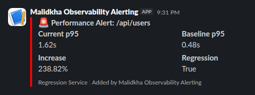
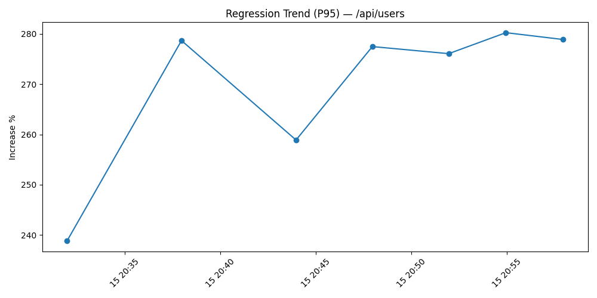

# Performance Observability & Automated Regression Detection V2 Pipeline

A containerized end-to-end (almost :upside_down_face:) **performance observability and automated regression detection system** for PHP applications.

This project integrates:

- ⚡ Nginx + PHP-FPM application layer
- 📊 Prometheus metrics collection
- 📈 Grafana dashboards
- 🔥 SPX PHP profiler with flamegraphs
- 🚨 Alertmanager for alert routing
- 🤖 Custom Automated regression detection service (:snake: Python) 
- 🧪 k6 load testing for automated performance validation
- 📄 PDF report generation for baselines & regressions (:snake: Python)

This project is intended as a practical demo of how to wire **PHP request metrics**, **alerting**,  **dynamic profiler activation**,  **automatic regression detection** and **historical trend analysis & tracking** together into a reproducible Docker-based performance observability & automated regression detection pipeline.

## Table Of Contents

   - **[Overview](#overview)**
   - **[Architecture](#architecture)**
   - **[Project Structure](#project-structure)**
   - **[Prerequisites](#prerequisites)**
   - **[Quick Start](#quick-start)**
   - **[Endpoints & Routes](#endpoints-routes)**
      - **[Service Endpoints](#service-endpoints)**
      - **[Application routes](#application-routes)**
      - **[Metrics and profiling](#metrics-and-profiling)**
      - **[API Endpoints](#api-endpoints)**
         - **[Regression Service (`:8090`)](#regression-service-8090)**
         - **[Report Service (`:5100`)](#report-service-5100)**
   - **[Environment Variables](#environment-variables)**
   - **[How it works](#how-it-works)**
      - **[Baseline storage](#baseline-storage)**
      - **[Alert handling](#alert-handling)**
      - **[Regression service](#regression-service)**
      - **[SPX profiling & Flamegraphs](#spx-profiling-flamegraphs)**
   - **[Full Workflow](#full-workflow)**
      - **[General](#general)**
      - **[Baseline generation workflow](#baseline-generation-workflow)**
      - **[Regression alert workflow](#regression-alert-workflow)**
      - **[Manual regression check](#manual-regression-check)**
   - **[The Tracked Metrics](#the-tracked-metrics)**
   - **[Reports and Artifacts](#reports-and-artifacts)**
   - **[Notes](#notes)**
   - **[Troubleshooting](#troubleshooting)**
      - **[Common Issues](#common-issues)**
      - **[Logs](#logs)**
   - **[Contributing](#contributing)**
   - **[Additional Resources](#additional-resources)**
   - **[License](#license)**

## Overview

This project is designed to detect performance regressions automatically by:

1. collecting request latency metrics from PHP routes,
2. comparing current performance against stored baselines,
3. triggering SPX profiling when a route slows down,
4. sending Slack alerts if configured,
5. generating PDF regression reports,
6. surfacing flamegraphs and metrics for root cause analysis.
7. Automated generation of baseline and regression reports, historical trend analysis & tracking


## Architecture

The stack is designed to demonstrate a simple full pipeline:


```bash
[k6 Load Test]
      ↓
   Nginx
      ↓
 PHP-FPM Application
      ↓
Prometheus Metrics Exporter
      ↓
Prometheus Server
      ↓
Alertmanager
      ↓
Regression Detector (Python)
      ↓
Generate PDF Report & Historical Tracking (Python)
      ↓
SPX Trigger Service
      ↓
SPX PHP Profiler
      ↓
Flamegraph Storage
      ↓
Flamegraph UI
      ↓
Grafana Dashboards + Slack Alerts
```

- `nginx` reverse-proxies traffic to the PHP application
- PHP app exposes `/metrics`, `/flamegraphs`, and application routes
- Prometheus scrapes PHP, Nginx, and PHP-FPM exporter metrics
- Alertmanager sends webhook alerts to the regression service
- Regression service loads baselines from Redis and evaluates current metrics
- Regression service triggers SPX profiling via Redis and generates reports
- Report service writes baseline and regression PDF reports to disk
- `k6` generates synthetic traffic to validate baseline and regression behavior

## Project Structure

```bash
├── docker-compose.yml          # Main orchestration
├── alertmanager/               # Alert routing
├── k6/                         # Load testing scripts
├── nginx/                      # Web server config
├── php/                        # PHP-FPM setup
├── prometheus/                 # Metrics config
├── regression-service/         # Python regression detector
├── report-service/             # Python PDF generator
├── src/                        # PHP application
├── reports/                    # Generated PDFs
├── spx-data/                   # Flamegraph storage
└── testing/                    # Test utilities
└──.env.example                 # Sample environment configuration
```


## Prerequisites

- Docker
- Docker Compose

Optional:
- `K6` & `jq` (only if need to test locally with `/testing`)

## Quick Start

**1. Clone repository**

```bash
git clone https://github.com/khalid-el-masnaoui/Performance-Observability-Automated-Regression-Detection-V2-Pipeline.git
cd performance-observability-automated-regression-detection-v2-pipeline
```

**2. Prepare environment**

Copy the example env file:

```bash
cp .env.example .env
```

Update values as needed, especially **`SLACK_WEBHOOK`**.

**3. Start the full stack**

```bash
docker compose up -d --build
```

**4. Validate services**

```bash
curl http://localhost:8090/health # regression service
curl http://localhost:5000/health # report service
```

**5. Generate baseline and run test scenarios**

The k6 service is configured to:

- warm up the app
- run baseline traffic
- collect Prometheus metrics
- send baseline snapshots to `regression-service`
- simulate slow requests

**Note**: k6 traffic is automatically triggered the first time the application is up (using `k6/entrypoint.sh`), so you do not need to do anything. 
You can however manually generate traffic locally using `testing/makefile` or Run the k6 entrypoint directly:

```bash
# Run the k6 entrypoint directly
docker compose run --rm k6
docker compose logs -f k6 # follow logs

# or locally
cd testing/
make test-ai-anomaly-detection
```

**6. Inspect reports and flamegraphs**

- Baseline and regression PDFs are written to `./reports`
- SPX JSON profiles are written to `./spx-data`
- Flamegraph browser is available at `http://localhost:8080/flamegraphs`
- Prometheus UI: `http://localhost:9090`
- Grafana UI: `http://localhost:3000`
- Alertmanager UI: `http://localhost:9093`


## Endpoints & Routes

### Service Endpoints
| Service | URL | Notes |
|---|---|---|
| PHP App | http://localhost:8080 | Main web app routes and `/flamegraphs` |
| Prometheus | http://localhost:9090 | Scrapes app and exporter metrics |
| Alertmanager | http://localhost:9093 | Receives alerts from Prometheus |
| Grafana | http://localhost:3000 | Dashboarding (not provisioned by default) |
| Regression Service | http://localhost:8090 | Baseline, alert, manual checks |
| Report Service | http://localhost:5100 | PDF generation endpoints |
| SPX Web UI | http://localhost:8080/?SPX_KEY=dev&SPX_UI=1&SPX_UI_URI=/ | PHP-SPX Profiling Web UI


### Application routes

- `/` — home route
- `/api/users` — sample API route
- `/api/users?delay=<seconds>` — simulate slow requests

### Metrics and profiling

- `/metrics` — Prometheus metrics endpoint
- `/flamegraphs` — searchable SPX flamegraph list
- `/spx-data/` — raw SPX JSON profile output


### API Endpoints

#### Regression Service (`:8090`)

- `POST /baseline` - Store baseline metrics
- `POST /alert` - Handle Prometheus alerts
- `POST /check` - Manual regression check
- `GET /health` - Health check

#### Report Service (`:5100`)

- `POST /generate-baseline` - Generate baseline PDF report
- `POST /generate` - Generate regression PDF report
- `GET /health` - Health check


## Environment Variables

Use **`.env`** to configure runtime settings for the PHP app, k6, and services.

Important variables:

- `REDIS_HOST` — Redis service
- `NGINX_URL` — Nginx URL used by k6 and scripts
- `PROM_URL` — Prometheus URL used by k6
- `REPORT_URL` — report-service URL
- `REGRESSION_SERVICE_URL` — regression-service URL
- `SLACK_WEBHOOK` — Slack webhook for alert notifications


## How It Works

### Baseline storage

The regression service stores baseline metrics in Redis using keys like `baseline:/api/users`.

### Alert handling

Alert rule: `SlowEndpoint` triggers when p95 latency > 1s for any route.

`Alertmanager` sends alerts (based on `P95`) to the regression service at `/alert`

### Regression service

Endpoints:

- `POST /baseline` — store route baseline metrics in Redis and generate baseline PDF
- `POST /alert` — handle incoming Prometheus alerts, compute current metrics, and detect if regression against baseline (`> 30%`)
- `POST /check` — manually evaluate all stored baselines against current Prometheus metrics
- `GET /health` — health check

If a regression is detected, the service:

- triggers SPX profiling for the affected route
- sends Slack notification if `SLACK_WEBHOOK` is configured
- generates a PDF regression report via `report-service`

### SPX profiling & Flamegraphs

- SPX is enabled by the Nginx `fastcgi_param PHP_VALUE "auto_prepend_file=/var/www/html/spx_prepend.php"` setting.

- The file `src/spx_prepend.php` connects to Redis and enables profiling only when `spx:{route}` is set.

- The flamegraph browser is served by `src/flamegraphs.php` and static JSON files under `/spx-data`.


## Full Workflow

### General

k6 simulates:

- baseline traffic to generate the baseline
- slow endpoint traffic (?delay=) to trigger a regression

**Note**: k6 traffic is automatically triggered the first time the application is up (using `k6/entrypoint.sh`). You can also generate traffic locally using `testing/makefile`

```bash
0-15s    → warmup phase with 20 requests
15s-20s  → generate baseline
20-50s   → metrics accumulate
50-80s  → p95 increases
~80s    → alert enters "pending"
~140s   → alert fires
         ↓
         regression detected → Redis(spx-enabled)
         ↓
         slack alert
         ↓
         regression report generated
         ↓         ↓
next request → SPX profiling ON
         ↓
flamegraph generated
```

### Baseline generation workflow

1. k6 runs baseline traffic through `/` and `/api/users`
2. Prometheus scrapes the resulting metrics
3. `k6/entrypoint.sh` queries Prometheus for `p95`, `p99`, `avg`, `error_rate`, `max_latency`, and `throughput`
4. Baseline data is posted to `regression-service` `/baseline`
5. `report-service` generates a baseline PDF and trend chart

### Regression alert workflow

1. Prometheus fires `SlowEndpoint` when `p95 > 1s`
2. Alertmanager sends the alert payload to `regression-service` `/alert`
3. `regression-service` loads the stored baseline from Redis
4. It queries current metrics and flags a regression when the increase is `> 30%`
5. If regression is present:
   - SPX profiling is triggered for the route
   - Slack notification is generated
   - Regression PDF report is generated

### Manual regression check

Use the manual endpoint to evaluate all stored baselines at once:

```bash
curl -X POST http://localhost:8090/check
```

This will run the same regression evaluation for all routes in Redis.

## The Tracked Metrics

| Metric      | Why                 |
| ----------- | ------------------- |
| p95         | tail latency        |
| p99         | extreme latency     |
| avg         | overall performance |
| rps         | traffic load        |
| error_rate  | reliability         |
| max_latency | spikes              |
| throughput  | system capacity     |

**Note**: the regression is only checked against `P95`, you can extend it to include other metrics.

## Reports and Artifacts

- `reports/baselines/` — baseline PDF reports (you find report examples in `example-reports`)
- `reports/regressions/` — regression PDF reports (you find report examples in `example-reports`)
- `spx-data/` — SPX profile JSON output

The regression report contains: 

| Feature              | Included |
| -------------------- | -------- |
| p95/p99/avg          | ✅        |
| throughput           | ✅        |
| max latency          | ✅        |
| error rate           | ✅        |
| historical trends    | ✅        |
| charts               | ✅        |
| historical tables    | ✅        |
| regression evolution | ✅        |

<p float="left" align="middle">
     
     
</p>

## Notes

- Route normalization is implemented in `src/index.php` to replace numeric IDs and UUIDs with normalized route labels.
- Metrics are recorded using Prometheus histograms with route, method, and status labels.
- The sample PHP app is intentionally simple and can be replaced by any PHP codebase.


## Troubleshooting

### Common Issues

**Flamegraphs not generating**:
```bash
# Ensure permissions
chmod -R 777 spx-data
chmod 33:33 spx-data # 33 is the UID of www-data which php-fpm/nginx runs under
```

**SPX Profiling not triggering**:
- Check Redis connection
- Verify SPX configuration in `php/spx.ini`

Make sure keys are created in redis

```bash
docker exec -it prometheus-spx-redis-1 redis-cli KEYS "*"
```

**No alerts firing**:
- Verify Prometheus can reach Alertmanager
- Check alert rules syntax

**Regression not detected**:
- Ensure baseline is set
- Check Prometheus query alignment
- Verify sufficient traffic volume

**Baseline & Regression reports missing**:
- If regression reports are missing, confirm `report-service` is healthy at `http://localhost:5100/health`.


### Logs

View service logs:
```bash
docker compose logs -f [service-name]
```


## Contributing

Contributions are welcome! Please feel free to submit a Pull Request.

## Additional Resources

- [Prometheus Documentation](https://prometheus.io/docs/)
- [Grafana Documentation](https://grafana.com/docs/)
- [k6 Documentation](https://k6.io/docs/)
- [SPX Profiler](https://github.com/NoiseByNorthwest/php-spx)

## License

This repository has no license defined; add one if you want to share or publish it.
